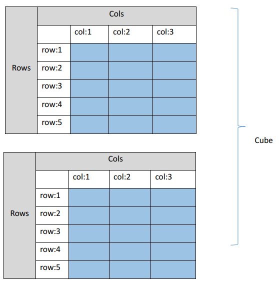
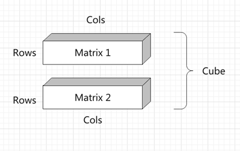
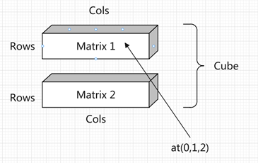

# 张量 Tensor 类和输入数据的内存排布

## 关于维度

在 `Tensor` 张量中，共有三维数据进行顺序存放，分别是 Channels (维度)，Rows (行), Cols (列)，

三维矩阵可以看作多个连续的二维矩阵组成，最简单的方法就是嵌套`std::vector`，但是这种方法非常不利于**数据的访问（尤其是内存不连续的问题） 、修改以及查询，特别是在扩容的时候非常不方便。不能满足使用需求**

综合考虑灵活性和开发的难易度，以`Armadillo`类中的`arma::mat`(矩阵 matrix)类和`arma::cube` 作为数据管理(三维矩阵)类来实现 `Tensor`，本项目中一个`cube`由多个`matrix`组成，`cube`又是`Tensor`类中的数据实际管理者

`Tensor`类中的数据均由`arma::cube`类进行管理扩充

`arma::cube`是一个多维矩阵，分别是通道维度(`slices`或者`channels`)，行维度(`rows`)和列维度(`cols`)，下图中是两个 5 行 3 列的矩阵，两个`Matrix`组成一个`Cube`，如下图

蓝色的区域是数据的实际存储区，灰色和和白色部分仅用作示意，在内存中实际不存在。一个`cube`类由多个这样的`Matrix`组成，图中表示的情况是`arma::cube(2,5,3)`，表示当前的三维矩阵共有 2 个矩阵构成，每个矩阵都是 5 行 3 列的。如果放在本项目中会以这种形式提供`Tensor tensor(2,5,3)`

下图是这种情况下的三维结构图

可以看出这个`Cube`一共有两个`Matrix`。一个`Channel`放一个`Matrix`. `Matrix`的行列为`Rows`和`Cols`.

## Tensor类方法总览

`Tensor`类是对`armdillo`库中`cube`类的封装，`cube`是多个`Matri`x的集合（二维矩阵的集合）
在这里对`Tensor`类的方法进行一个总览

| 类名                                                            | 功能                                                                                                                                                                                                                                                                                 |
|-----------------------------------------------------------------|--------------------------------------------------------------------------------------------------------------------------------------------------------------------------------------------------------------------------------------------------------------------------------------|
| `rows()`                                                          | 返回`Tensor`的行数                                                                                                                                                                                                                                                                     |
| `cols()`                                                          | 返回`Tensor`的列数                                                                                                                                                                                                                                                                     |
| `Fill(float value)`                                               | 填充`Cube`中的数据，以`value`值填充                                                                                                                                                                                                                                                      |
| `Padding()`                                   | 调整`Matrix`的维度，扩展`rows`和··`cols`                                                                                                                                                                                                                  |
| `at(uint32_t channel, uint32_t row, uint32_t col)`                | 返回`Cube`中第`channel`维，第`row`行，第`col`列的数据。                                                                                                                                                                                                                                      |
| `index(uint32_t offset)`                                          | 以另外一种方法来返回数据，返回`Cube`中第`offset`个数据，比如说在`row`行，`col`列，`c`维的一个数据，除了可以用`tensor.at(c,row,col)`方法访问。也可以通过 `tensor.index(c * Rows * Cols + row * Cols + col)`这种方式来访问
| `Fill(values)` | 以`values`中的所有数据去填充`Tensor`中的数据管理器--`cube`类，注意`values`中数据的数量要等于`Cube`的行数×列数×维度                                                                                                                                                  |
| `Flatten()`                                                       | 将三维的矩阵展开铺平为一维的。                                                                                                                                                                                                                                                       |

## Tensor 类模板

Tensor共有两个类型，一个类型是`Tensor<float>`，另一个类型是`Tensor<uint8_t>`，`Tensor<uint8_t>`暂时未实现，所以在这`Tensor`来指代`Tensor<float>`

### 如何创建一个 Tensor

`Tensor<float> tensor(3, 5, 3)`
可以用一个非常简单的方式来创建一个张量实例，在如上的定义中，得到了一个通道数量为3,行数(rows)为5,列数(cols)为3的`tensor`

### 如何访问 Tensor 中数据

再次为`Tensor`类定义了多种访问内部数据的方式

首先要讲的是顺序访问方式，在`tensor`变量中，可以使用`tensor.at(0, 1, 2)`得到`tensor`变量中第0通道，第1行，第2列中存放的元素。另外一种，可以使用`tensor.index(0)`这种方法来得到`tensor`变量中第0个数据 

从下图中可以看出，`tensor.at(0,1,2)`就是访问图中对应位置的点。第1个矩阵(channel = 0)中第2行(row = 1)，第3列(col = 2)中的数据

## 再谈谈 Tensor 类中数据的排布

`Tensor`类是`arma::cube`对外更方便的接口，所以说`armadillo::cube`怎么管理内存的，`Tensor`类就是怎么管理内存的

如果将顺序的一组数据`[0,1,2,3,4,5....128]`存放到一个大小为`32×8`的Matrix中，那么需要注意一个问题，本项目种`Tensor(arma::cube)`是列主序的，这一点和`Eigen`或者 OpenCV 中的`cv::Mat` `numpy`有一些不同

列主序在内存中的顺序如下表

现在已知有一个序列`[0,1,2,3,4,5....19]`被存放到`5×4`的`Matrix`中

列主序（例如`armadillo`）逐列存储

| 0 | 5 | 10 | 15 |
|---|---|----|----|
| 1 | 6 | 11 | 16 |
| 2 | 7 | 12 | 17 |
| 3 | 8 | 13 | 18 |
| 4 | 9 | 14 | 19 |

行主序（例如`OpenCV`）逐行存储

| 0  | 1  | 2   | 3  |
|----|----|-----|----|
| 4  | 5  | 6   | 7  |
| 8  | 9  | 10  | 11 |
| 12 | 13 | 14  | 15 |
| 16 | 17 | 18  | 19 |